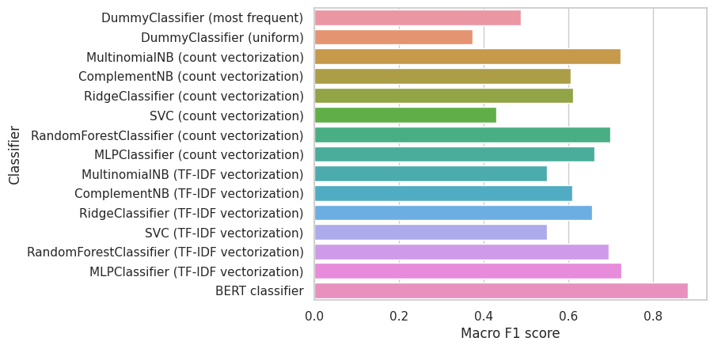
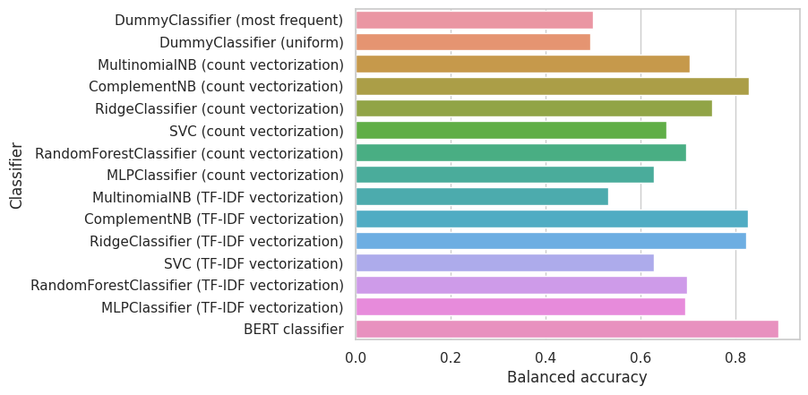
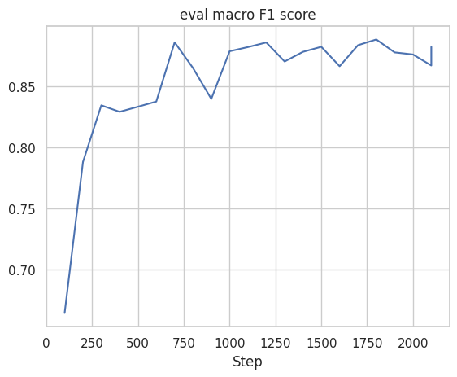
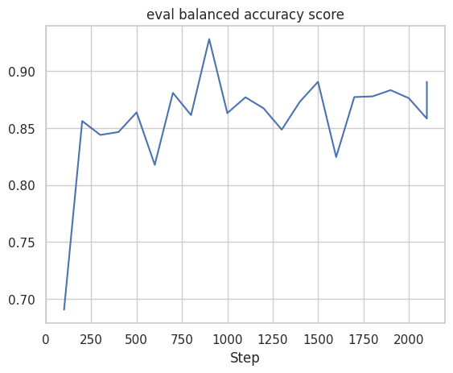

# Phase 2. Modeling

<div dir="rtl">

در مرحله ابتدایی پیش‌پردازش داده مانند فاز اول انجام شده و در این مرحله
داده‌های اضافی حذف شده، داده‌های آموزش و تست جداسازی شده و هم‌چنین با
lemmatization و stemming به صورت bag of words برای تعدادی از مدل‌ها
درمی‌آیند.

برای مدل baseline از مدل‌های dummy classifier با استراتژی most frequent
و random استفاده شده و برای متریک‌های ارزیابی مدل از macro F1 score به
عنوان متریک اصلی و balanced accuracy score به عنوان متریک فرعی استفاده
شده‌اند. این متریک‌ها به این علت انتخاب شده‌اند که داده‌های آموزشی و
ارزیابی به شدت نامتوازن (۹۴٪ با برچسب صفر) هستند و این دو، متریک‌های
مناسبی برای ارزیابی و بررسی عملکرد مدل برای این گونه داده‌ها هستند.

در مرحله مدل‌سازی، مدل‌های زیر توسعه یافته و موردبررسی قرار گرفته‌اند:

-   مدل‌های توسعه یافته براساس bag of words (هم ویژگی‌های تعداد کلمات و هم TF-IDF)

    -   Multinomial Naïve Bayes

    -   Complement Naïve Bayes

    -   Ridge Regression

    -   SVM

    -   Random Forest

    -   Multi-Layer Perceptron

-   مدل مبتنی بر embedding کلمات با استفاده از BERT

از میان مدل‌های فوق به دلیل محدودیت‌های پردازشی برای مدل‌های Ridge
Regression، SVM، Random Forest و MLP از کاهش ابعاد با استفاده از SVD نیز
استفاده شده است. پس از کاهش ابعاد هم برای ویژگی‌های تعداد کلمات و هم
ویژگی‌های TF-IDF می‌بینیم که تعداد ویژگی‌ها از ۲۳۰۴ به ۲۰۰ ویژگی با نسبت
explained variance ratio حدود ۵۰٪ کاهش می‌یابد. از روش SVD به این دلیل
استفاد شده است که برای کاربرد دسته‌بندی متون و NLP به طور کلی عملکرد
بهتری دارد. برای یافتن hyperparameterهای مدل‌های گفته شده نیز در تعدادی
موارد از grid search یا randomized grid search بسته به هزینه پردازشی
جستجو استفاده شده است.

برای مدل مبتنی بر bert نیز از توکنایزر و embedding مدل bert همراه با یک
لایه پرسپترون برای دسته‌بندی استفاده شده است. در این مورد به دلیل زمانبر
بودن آموزش مدل، hyperparameterها به صورت دستی fine-tune شده‌اند. هم‌چنین
از early stopping (برای جلوگیری از overfitting) و class weights (چون
داده‌های نامتوازن هستند) نیز استفاده شده است.

پس از توسعه مدل‌ها، براساس متریک‌های ذکر شده آن‌ها را مقایسه و ارزیابی
می‌کنیم:




می‌بینیم که مدل bert از لحاظ هر دو متریک بهترین عملکرد را داشته است. پس
از آن مدل Multinomial Naïve Bayes بهترین عملکرد از لحاظ F1 score و مدل
Complement Naïve Bayes بهترین عملکرد از لحاظ Balanced accuracy را داشته
است.

در این صورت ما مدل برت را به عنوان بهترین مدل در نظر می‌گیریم با توجه به
این که با اختلاف قابل توجهی عملکرد بهتری از سایر مدل‌ها داشته است. هر
چند که آموزش و اجرای این مدل هزینه پردازشی بسیار بیش‌تری از مدل‌های دیگر
دارد. هر چند با توجه ظرفیت بالای این مدل در صورت توسعه و آموزش بیشتر این
مدل و رسیدن به دقت‌های بالاتر، می‌توان هزینه پزدازشی آن را بهتر توجیه
نمود.

در نهایت هم نمودار آموزش مدل را نیز برای متریک‌های گفته شده به صورت زیر
می‌بینیم:





هم‌چنین classification report را برای مدل انتخاب شده به صورت زیر داریم:

```
Train F1 score: 0.957
Test F1 score: 0.883
Train balanced accuracy: 97.9%
Test balanced accuracy: 89.1%

              precision    recall  f1-score   support

           0       0.99      0.99      0.99      2694
           1       0.76      0.79      0.78       136

    accuracy                           0.98      2830
   macro avg       0.88      0.89      0.88      2830
weighted avg       0.98      0.98      0.98      2830
```

می‌بینیم که تا حدودی اختلاف قابل توجهی میان دقت و f1 score برای داده
آموزشی و تست وجود دارد که نشان‌دهنده این است که مدل تا حدودی بیش‌برازش
شده است. هم‌چنین می‌بینیم که مدل تمایل بیشتری به پیشبینی برچسب‌های منفی
دارد. هر دو این مسائل نشان‌دهنده این است که مدل می‌توان به دقت و عملکرد
بهتری برسد. هر چند زمان‌بر بودن آموزش مدل یکی از محدودیت‌های است که مانع
توسعه بیشتر مدل شده است.

</div>
